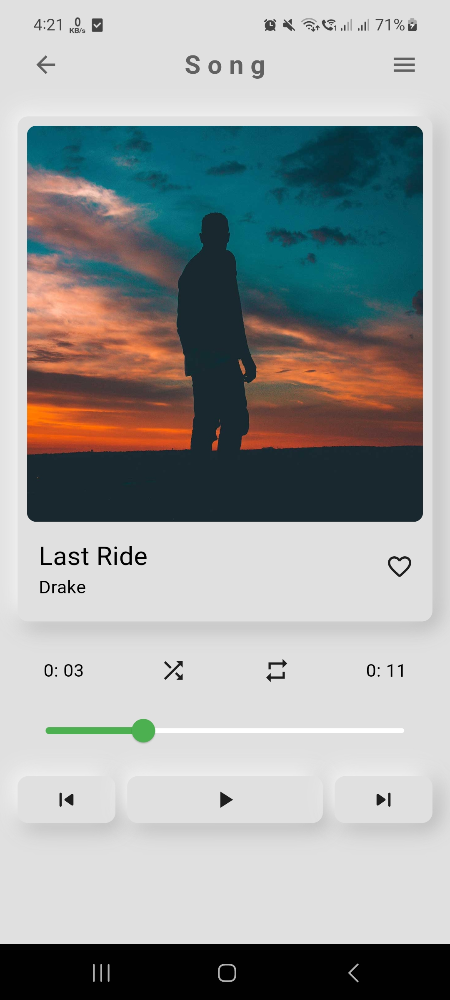
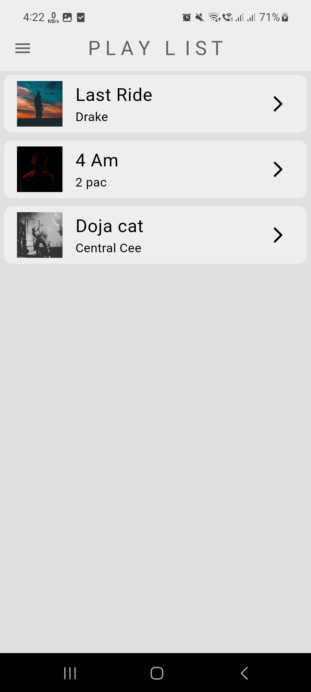

# Music Player

A stunning Flutter-based Music Player application. This app allows users to play, pause, and navigate through a playlist of songs with a clean and modern UI.

## Table of Contents
- [Features](#features)
- [Screenshots](#screenshots)
- [Installation](#installation)
- [Usage](#usage)
- [Contributing](#contributing)

## Features
- **Home Page**: Displays the list of songs in a playlist.
- **Song Page**: Shows detailed view of the currently playing song with playback controls.
- **Settings Page**: Allows toggling between dark mode and light mode.
- **Playlist Management**: Navigate between songs, shuffle, and repeat songs.
- **Player Controls**: Play, pause, seek, and skip songs.

## Screenshots




## Installation
1. **Clone the repository**:
    ```bash
    git clone https://github.com/your-username/music-player.git
    cd music-player
    ```

2. **Install dependencies**:
    ```bash
    flutter pub get
    ```

3. **Run the app**:
    ```bash
    flutter run
    ```

## Usage
### Home Page
The home page displays the list of songs in the playlist. Tap on any song to navigate to the Song Page.

### Song Page
The song page displays the album art, song name, artist name, and playback controls. You can play, pause, and seek within the song. Use the next and previous buttons to navigate through the playlist.

### Settings Page
The settings page allows you to toggle between dark mode and light mode using a simple switch.

## Code Structure
- **Components**: Contains reusable widgets such as `Drawer` and `NeuBox`.
- **Models**: Contains the `PlaylistProvider` and `Song` models which handle the data and business logic.
- **Pages**: Contains the main pages of the app (`HomePage`, `SongPage`, `SettingsPage`).
- **Theme**: Contains the `ThemeProvider` for managing the app's theme.

### PlaylistProvider
Handles the playlist management, including playing, pausing, seeking, and navigating between songs.

### Song
Represents a song with properties like song name, artist name, album art image path, and audio path.

## Contributing
Contributions are welcome! Please follow these steps:
1. Fork the repository.
2. Create a new branch (`git checkout -b feature-branch`).
3. Make your changes.
4. Commit your changes (`git commit -m 'Add some feature'`).
5. Push to the branch (`git push origin feature-branch`).
6. Create a new Pull Request.


